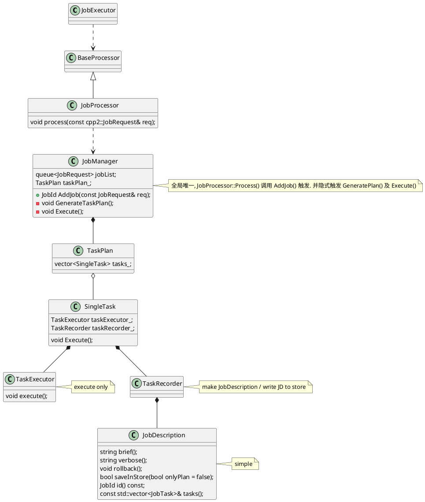

# Job Manager 
[toc]

## 需求
### 2. Sherman 2019-11-02
1）当有job正在运行，新job不应该被拒绝，而是应该在队列中排队
2）需要能够终止正在进行中的，或者是在排队的job
3）保留一定的历史纪录，比如24小时，或者一周内完成的job，便于查询。超过时间的可以被backup出去，以便调查

### 1. 老司机 2019-11-02
为什么不让用户选择怎么处理在跑的老job呢？

### 0. 倒爷 2019-10-28
1. 命令发出后 console 不阻塞, 直接返回一个 job id
2. user 可以通过这个 job id 来查询 job 的执行状态(running, finished)
3. 同一时间只允许一个 job 运行.
   就是说, 现在只允许compact, ingest, download 同时运行一个, 
   如果新添加任务时, 还有运行中的任务, 则将此新任务踢退.
   
## Usage
use myspace_test3
bjob "hello world 123"
   
## 设计
### 概要设计




## Q&A
* ***meta 在将一个 job 置为 running 之后, 发生主 meta 切换.***
  这条主要是防止两个 meta 跑同一个 job. 
  (即使有 service, 也不考虑标为 running 的 job)
  
  Meta A 接着跑 Job A. Meta B启动后等待用户命令触发. 不去主动扫描 kvstore
  
   
* ***meta 在将一个 job 置为 running 之后, 自己挂了, 怎么办?***
    暂时就只能让它在那. 
    
    
  这条是要考虑, 如果一个挂了的节点hold 着一个 running 的任务,
  那么后续 所有的job 都会无法执行
  
  meta 需要与 kvstore 的对应 job 条目建立心跳机制
  
  (心跳是不行的, 心跳要建立在心跳间隔之上, 而跨机器的时间不可靠, 不能用 B 机器的时间去衡量 A 的心跳是否过期)
  
* meta 中的 key 设计 
    倒爷 : 参考 balance (2019-11-07)
* stop job 的逻辑 
    倒爷 : 只考虑 stop 未开始的 (2019-11-07)
  
* 什么是 job recovery
    倒爷 : 暂时不考虑
    如果做的话, 假如 10 个 download job, 失败了 3 个, 需要重启这 3 个.
    (2019-11-07)

* 排队策略
    队列放在 meta 内存中, 不进入 kvstore,
    接受一旦掉电, job 可以丢失.
    
    meta 如果将某 job 置为 running 后挂掉. 在下一次 recovery 时重置
    
    add job 可以接受用户指定一个名字
    
    job 的清理可以由某次 compaction 完成, 或者不清理
    
## 潜在问题
    
## 开发记录

### 重要的接口和逻辑

```c++
// 第一版可能跟后续版本有较大区别, 另外这里很有可能是 MetaJobManager
KVJobManager : public JobManager;

class JobManager {
public:
    virtual ~JobManager() = default;

    /*
     * Parameter: 
     *      type - job type, can be any string (做不做有效性检查可以确认下)
     * Return: 
     *      if success, return a positive number of job id. -1 if failed. 
     */
    virtual int AddJob(const std::string& type) = 0;

    /*
     * Parameter: 
     *      jobId - father 's JobId. Return by prev call of AddJob.
     * Return: 
     *      if success, return a positive number of job id. -1 if failed. 
     * Comments:
     *      Assume meta server knows how many sub tasks will be run. ()
     *      Each 
     */
    virtual int AddSubTask(JobId jobId) = 0;

    /*
     * Description:
     *      erase all job between[job 0 to job Id] record from DB.
     * Parameter: 
     *      jobId - indicate the last job erased from DB. 
     * Return: 
     *      erased job number 
     * Comments:
     *      随着时间的推移, 会有很多无用的信息在数据库中, 可以用这个接口删除.
     */
    virtual int EraseJobsBefore(JobId jobId) = 0;

    /*
     * Parameter: 
     *      father 's JobId
     * Return: 
     *      0 if succeed, -1 if can't find the specific jobId, subTaskId and key 
     */
    virtual int UpdateJob(JobId jobId, JobId subTaskId, const std::string& k, const std::string& v) = 0;

    /*
     * Parameter: 
     *      as parameter name
     * Return: 
     *      Sub task id
     */
    virtual std::string FindJob(JobId jobId) = 0;

    /*
     * Parameter: 
     *      father 's JobId
     * Return: 
     *      Sub task id
     */
    virtual std::vector<std::string> ListJobs() = 0;

     /*
      * 支持将 job 备份到某处(由 setter设定, 如果不传, 默认是删除?)
      */
    // template<typename Setter>
    // virtual std::vector<std::string> BackupJob(JobId jobBegin, JobId jobEnd, Setter& s) = 0;
    virtual std::vector<std::string> BackupJob(JobId jobBegin, JobId jobEnd) = 0;

    /*
     * 因为 addjob 和 stopjob 完全有可能发往不同的 meta
     * 
     * 能依赖的只有 kvstore .
     * 
     * 那么假如我想 stop, 就只能在 kvstore 上加一个 flag
     * 
     * 由具体的 job 定期去检查这个 flag , 如果发现 stop = true, 则停止
     * 
     * (可能要求继承, 子类实现 stop 接口)
     * 
     * 否则还能怎样? storage 开一个 thrift 接口? 然后 storage 端也放一个 JobManager
     * 
     * 每次 stop 由 MetaJobManager RPC 给 StorageJobManager 一个 id,
     * 
     * StorageJobManager 维护一个JobPool, 直接从这个 pool 里把对应 job 干掉? 不太安全.
     * 
     */ 
    virtual int StopJob(JobId jid) = 0;

    /*
     * 这是个啥?
     */ 
    virtual int RecoverJob(JobId jid) = 0;
};
```

实现逻辑

```c++
int KVJobManager::AddJob(const std::string& type) {
    // 1. 分布式锁 (meta 是可能脑裂/换主的)
    // 2. 看当前有多少个 Job, 得出JobId
    //    2.1 这里有个问题, 如果之前的 Job 都被 Backup 了, 那么这里很有可能得到 0
    //          那么这个 0 再 backup 的时候要保证与之前的 job 不混淆
    //          而且不只是 0, 后面的 job 都尽量要保证可读性
    //    2.2 所以可以考虑放一个 key 专门控制 JobId 到多少
    //          每次加记录前先修改这个 JobId (要考虑集群初始化时的情况)
    //          这样, 哪怕是改完 JobId 后直接挂掉, 没有成功添加记录
    //          最多也就是在 backup Job  list 中留一个空
    // 3. 加一条记录
    // 4. 结束
}

```

### 物理存储 (KV 的键设计)

### 已知问题

## See Also

[Download and Ingest](https://www.yuque.com/nebulagraph/emchnb/ibdwgd)

目录

[toc]

